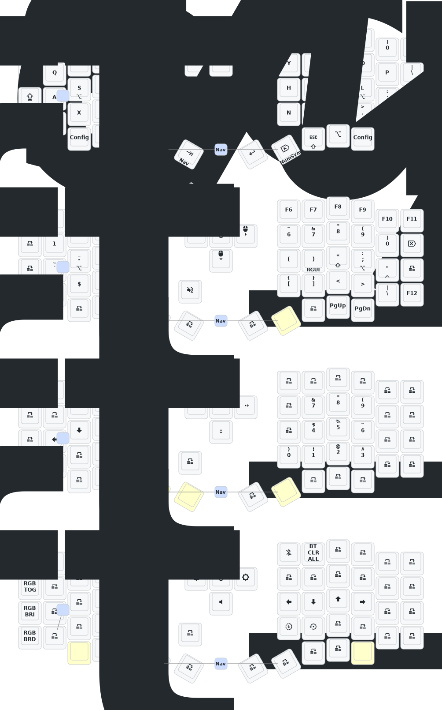

# Sofle

## Update List

- 2024/10/24
  1. Modified power supply mode to reduce power consumption.
  2. Fixed the automatic shut-off feature for RGB power supply.
- 2024/12/21
  1. Added support for zmk-studio (just refresh the left hand to use).
- 2025/3/30
  1. Increased sleep entry time to 1 hour, increased debounce time, optimized power consumption after sleep.
- 2025/8/22
  1. Updated soft off feature. When you press the Q, S, and Z keys simultaneously and hold them for 2 seconds, the keyboard will enter a deep sleep state and cannot be awakened by pressing keys. This function can be used when carrying it outside. To reactivate, press the reset switch once.
  2. This month, I also updated the ultra-thin versions of the Sofle and Corne cases. The frame and base plate have been thickened, and the reset switch opening has been adjusted so it can be easily pressed. We are still conceptualizing how to design a case with an inclined bracket. If you have carefully examined the PCB, you will notice there are reserved interfaces for expansion IO. I wonder if anyone can utilize them - I will try it!
  3. The GIF animations on the right-hand keyboard screen have been removed, which will significantly reduce the power consumption of the right-hand keyboard.

> If your keyboard was updated before 2025/8/22, please update to the latest firmware.

## Contact Me

For 3D printed model files or any issues and malfunctions with the keyboard, please contact [380465425@qq.com](mailto:380465425@qq.com)

## Sofle Keymap

